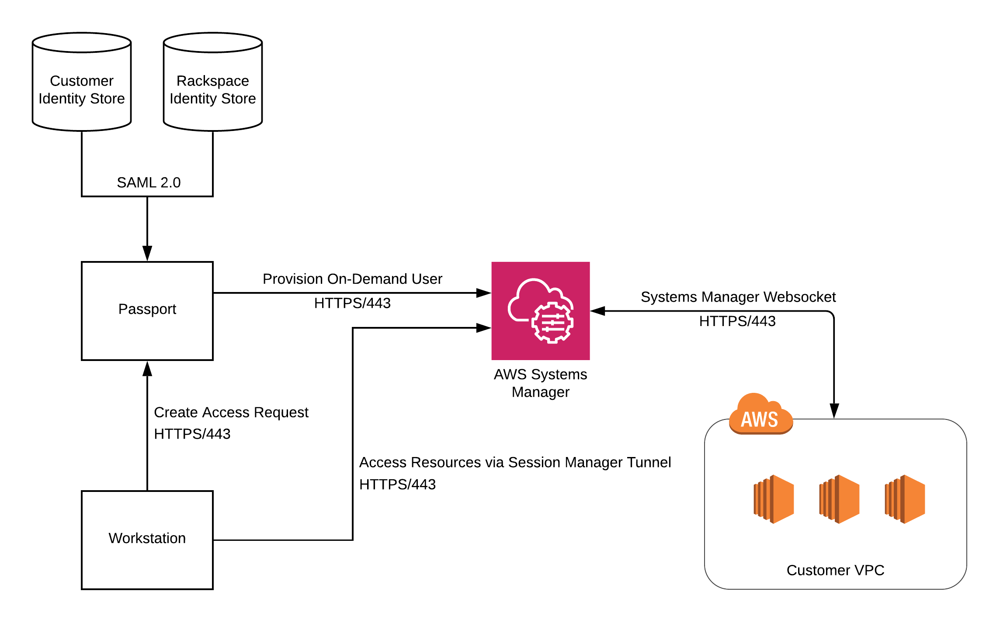

.. _v2_architecture:

Architecture
============

Passport provides secure, auditable access to servers inside a Virtual
Private Network (VPC). In addition to Passport, there are several other
components that play a part in this feature: AWS Systems Manager and Identity
Stores. This document discusses each of these components and the role they
play in governing server access.

**Passport** handles all orchestration for an access request including:
authenticating a user with their Identity Store via SAML, creation/deletion
of short-lived users, and generation of temporary credentials.

**AWS Systems Manager** is used to create short-lived users and distribute
credentials to servers that are accessed via Passport. Session Manager
tunneling is also used to make a network connection to the target servers.
Users are created at the time an access request is created and are cleaned
up when the access request is complete. Credentials are only valid for the
lifetime of the access request.

**Identity Store(s)** are the source of truth for all users and their
associated permissions. Rackspace Customer Identity is the identity store
that is used for customer users, and it can optionally be connected via SAML
to an on-premise identity store via Rackspace Identity Federation. Racker
permissions are stored in Rackspace's internal identity store.

1. **User creates an access request via Passport.** The user specifies
   their reason for access and the servers that can be accessed.
2. **Passport provisions a short-lived user on the servers being accessed.** On
   Linux-based systems, the short-lived user is authenticated with an SSH
   certificate. On Windows systems, the short-lived user is authenticated with
   a password. Both the SSH certificate and the password are generated by
   Passport and are only valid for the duration of the access request.
   Provisioning of the short-lived user is performed using Systems Manager
   Run Command.
3. **User connects to resources using a Session Manager tunnel.** Both SSH and
   RDP traffic are routed from the user's workstation through a Session Manager
   tunnel to the target resources. Once the tunnel is established, the SSH or
   RDP connection is authenticated using the temporary credentials generated
   during step 2.
4. **Passport removes the short-lived user from the server being accessed.**
   The short-lived user is removed and all associated credentials are
   revoked. Clean up of the short-lived user is performed using Systems
   Manager Run Command.
