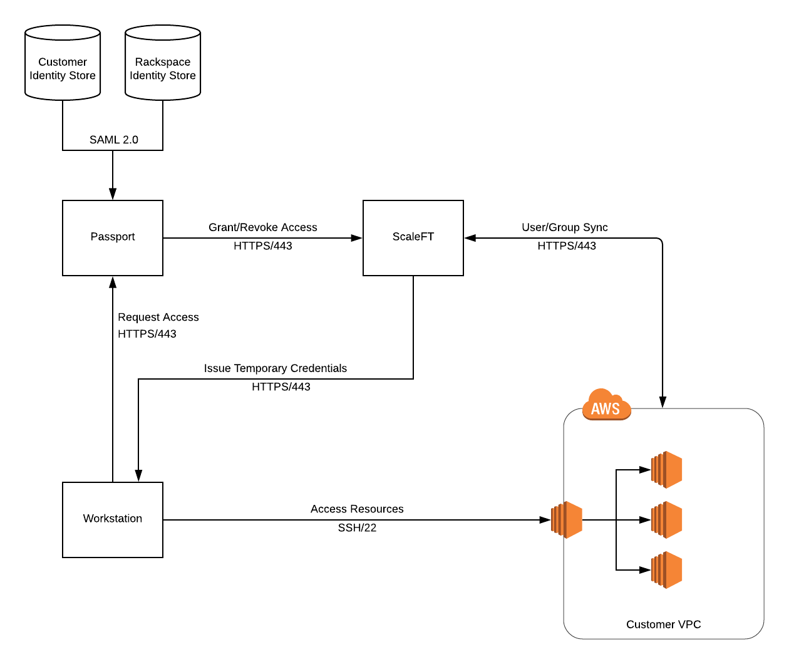

.. _architecture:

============
Architecture
============

Passport provides secure, auditable access to servers inside a Virtual
Private Network (VPC). In addition to Passport, there are several other
components that play a part in this feature: ScaleFT and Identity
Stores. This document discusses each of these components and the role
they play in governing server access.

**Passport** handles all orchestration for an access request
including: authenticating a user with their Identity Store via SAML,
creation/deletion of temporary bastion servers, and granting/revoking a
user's ability to retrieve temporary credentials from ScaleFT.

**ScaleFT** is responsible for managing users on each ScaleFT-connected
server and for issuing temporary credentials that can be used to access
ScaleFT-connected servers. Users are continually synced by the ScaleFT
agent that is installed on each server. Credentials may only be retrieved
by users who have been granted access by Passport.

**Identity Store(s)** are the source of truth for all users and their
associated permissions.
`Rackspace Customer Identity <https://developer.rackspace.com/docs/cloud-identity/v2/getting-started/>`_
is the identity store that is used for customer users, and it can optionally
be connected via SAML to an on-premise identity store via
`Rackspace Identity Federation <https://developer.rackspace.com/docs/rackspace-federation/>`_.
Racker permissions are stored in Rackspace's internal identity store.

Access Request Flow
-------------------

1. **User creates an access request via Passport.** The user specifies their
   reason for access, the source IP address from which access must occur, and
   the servers that can be accessed.
2. **Passport grants a user access to retrieve temporary credentials via
   ScaleFT.** The user is now able to retrieve temporary credentials to
   access each server in the access request.
3. **Passport creates a temporary bastion in a public subnet in the VPC where
   resources exist.** This bastion allows users to access resources that are
   not accessible directly via the Internet. Security group rules are defined
   so that access to the bastion is only allowed from the source IP address
   that was specified when the access request was created.
4. **User requests temporary credentials from their workstation using the
   ScaleFT client.** Credentials are valid for a few minutes and can be
   re-issued for the duration of the access request.
5. **User accesses resources using temporary credentials and the temporary
   bastion.** Both SSH and RDP traffic are routed from the user's workstation
   through the temporary bastion to the target resources.
6. **Passport tears down temporary bastion and revokes access to ScaleFT
   credentials.** ScaleFT will no longer issue temporary credentials to
   that user, the temporary bastion is deleted, and all networking changes
   are reverted.
